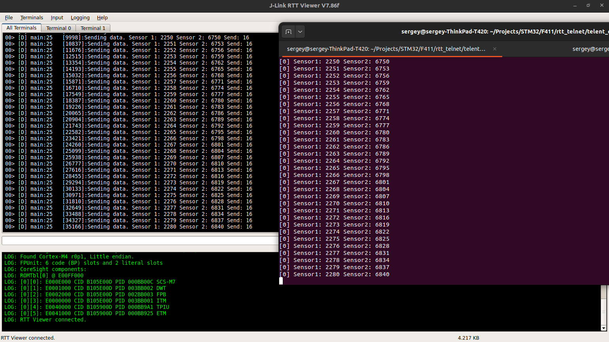
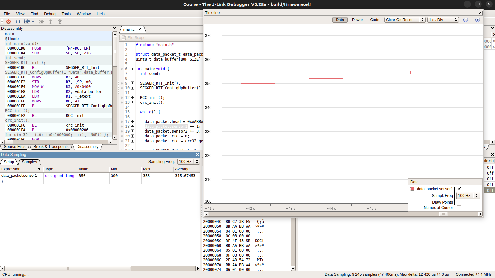

# Пример работы с несколькими каналами RTT

Пример сделан на отладочной плате Black Pill с МК STM32F411. Имитируется сбор данных с двух "датчиков" и сохранение их в структуре data_packet.

```
struct data_packet_t{
    uint32_t head;
    uint32_t sensor1;
    uint32_t sensor2;
    uint32_t crc;
};
```

Сообщения о значении показаний выводятся в 0-вой канал RTT. Макрос DEBUG объявлен в Lib/MyLib/log.h

```
#define DEBUG(fmt, args...) SEGGER_RTT_printf(0,"[D] %-20s:%-4d [%d]:" fmt "\r\n", __func__, __LINE__,dwt_get_tick_in_sec(), ## args)
```

К тексту самого сообщения добавлена отладочная информация.

В канал 1 RTT выводятся данные в формате структуры data_packet_t. При подключении к целевому МК JLink открывает telnet сервер на порту 19021. [Простой пример на С](telent_client/client.c) используется на стороне ПК для чтения данных из канала 1 RTT. В примере упрощена обработка пакета и поиск его начала, проверяется только CRC.

Сборка проекта при помощи Makefile. Для сборки должна быть установлена переменная окружения GCC_PATH или ее нужно установить в ручную в файле. 

Сборка примера для ПК:

```
gcc client.c 
```

Пример вывода:



В окне JLinkRTTViewer идут данные которые выводит макрос DEBUG в канал 0 RTT, в терминале идут данные которые были получены из канала 1 и обработаны на ПК.

Вывод сообщений из канала 0 в окне отладчика Ozone и одновременно получение данных из канала 1 в терминале.

График изменения значения переменно в отладчике Ozone:

